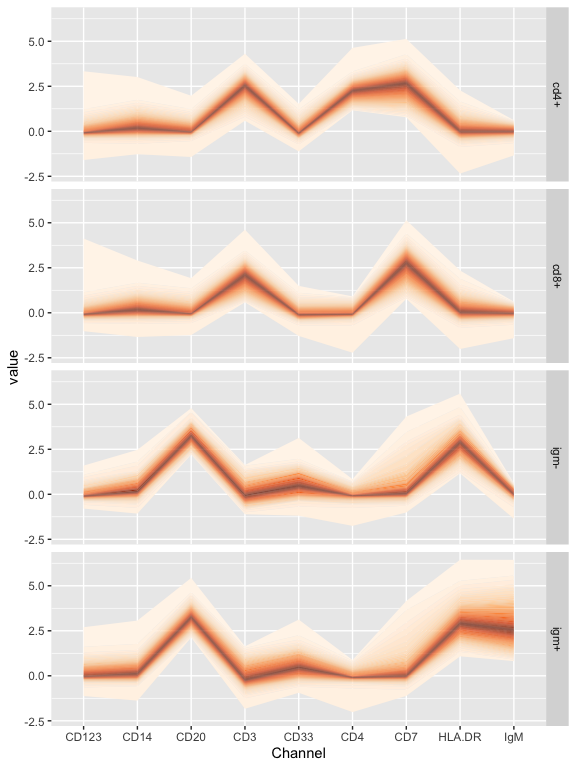

<!-- README.md is generated from README.Rmd. Please edit that file -->
cytofan
=======

[](https://travis-ci.org/yannabraham/cytofan)

`cytofan` implements the concept of fan plots ([Britton, E.; Fisher, P. & J. Whitley (1998) The Inflation Report Projections: Understanding the Fan Chart](https://www.bankofengland.co.uk/quarterly-bulletin/1998/q1/the-inflation-report-projections-understanding-the-fan-chart)) for cytometry data in ggplot2.

The `cytofan` package was implemented following up on a [gist](https://gist.github.com/yannabraham/6f8474ab32e8eec63c2e) written shortly after the [fanplot](https://cran.r-project.org/web/packages/fanplot/index.html) package was released. Compared to [ggfan](https://cran.r-project.org/web/packages/ggfan/index.html), `cytofan` uses categorical data as input on the x axis.

Installation
------------

You can install cytofan from github with:

``` r
# install.packages("devtools")
devtools::install_github("yannabraham/cytofan")
```

Example
-------

`cytofan` can be used to visualize differences between populations identifed using [mass cytometry](http://www.nature.com/nbt/journal/v30/n9/full/nbt.2317.html):

``` r
library(cytofan)
#> Loading required package: ggplot2
library(bodenmiller)
library(dplyr)
#> 
#> Attaching package: 'dplyr'
#> The following objects are masked from 'package:stats':
#> 
#>     filter, lag
#> The following objects are masked from 'package:base':
#> 
#>     intersect, setdiff, setequal, union
library(reshape2)

data("refPhenoMat")
data("refAnnots")

bind_cols(refAnnots,
          as.data.frame(refPhenoMat)) %>%
  melt(.,measure.vars=colnames(refPhenoMat),
       variable.name='Channel') %>%
  filter(Cells %in% c('cd4+','cd8+','igm+','igm-')) %>%
  ggplot(aes(x=Channel,y=value))+
  geom_fan()+
  facet_grid(Cells~.)
```


